# Jarkom-Modul-3-2025-K38

## 👥 Anggota Kelompok

| Nama                     | NRP        |
| ------------------------ | ---------- |
| Ahmad Syauqi Reza        | 5027241085 |
| Putri Joselina Silitonga | 5027241116 |

## Deskripsi Laporan 📝

---

# Soal 1

Soal ini intinya adalah memberi akses internet sementara ke semua node (kecuali Durin).

Kita diminta untuk mengatur nameserver di semua 19 node itu (Minastir, Aldarion, Elendil, Gilgalad, dll.) biar nunjuk ke 192.168.122.1.

Tujuannya cuma satu: biar mereka bisa apt update dan nginstal paket-paket yang dibutuhin buat soal-soal berikutnya.

### Durin

```
nano /etc/network/interfaces
```

```
# Interface ke NAT/Internet (Dynamic)
auto eth0
iface eth0 inet dhcp

# Interface ke Switch1 (Static)
auto eth1
iface eth1 inet static
    address 192.230.1.1
    netmask 255.255.255.0

# Interface ke Switch2 (Static)
auto eth2
iface eth2 inet static
    address 192.230.2.1
    netmask 255.255.255.0

# Interface ke Switch5 (Static)
auto eth3
iface eth3 inet static
    address 192.230.3.1
    netmask 255.255.255.0

# Interface ke Switch6 (Static)
auto eth4
iface eth4 inet static
    address 192.230.4.1
    netmask 255.255.255.0

# Interface ke Switch7 (Static)
auto eth5
iface eth5 inet static
    address 192.230.5.1
    netmask 255.255.255.0

```

```
echo "nameserver 192.168.122.1" > /etc/resolv.conf
```

restart network

```
iptables -t nat -A POSTROUTING -o eth0 -j MASQUERADE
```

### Allow forwarding dari internal ke internet

```
iptables -A FORWARD -i eth1 -o eth0 -j ACCEPT
iptables -A FORWARD -i eth2 -o eth0 -j ACCEPT
iptables -A FORWARD -i eth3 -o eth0 -j ACCEPT
iptables -A FORWARD -i eth4 -o eth0 -j ACCEPT
iptables -A FORWARD -i eth5 -o eth0 -j ACCEPT

# 5. Allow forwarding dari internet ke internal
iptables -A FORWARD -i eth0 -o eth1 -j ACCEPT
iptables -A FORWARD -i eth0 -o eth2 -j ACCEPT
iptables -A FORWARD -i eth0 -o eth3 -j ACCEPT
iptables -A FORWARD -i eth0 -o eth4 -j ACCEPT
iptables -A FORWARD -i eth0 -o eth5 -j ACCEPT


```

Konfigurasi Node dengan IP Static

1. Minastir (Forward Proxy)
   konfigurasi ip

```
# 1. Atur IP address
ip addr add 192.230.5.2/24 dev eth0

# 2. Nyalakan interface
ip link set eth0 up

# 3. Atur gateway
ip route add default via 192.230.5.1
```

```
nano /etc/network/interfaces
```

```
auto eth0
iface eth0 inet static
    address 192.230.5.2  # sesuaikan dengan IP yang diberikan
    netmask 255.255.255.0
    gateway 192.230.5.1  # gateway menuju router
```

```
echo "nameserver 192.168.122.1" > /etc/resolv.conf
```

2. Aldarion (DHCP Server)

```
# 1. Atur IP address
ip addr add 192.230.4.3/24 dev eth0
# 2. Nyalakan interface
ip link set eth0 up
# 3. Atur gateway
ip route add default via 192.230.4.1
```

```
nano /etc/network/interfaces
```

```
auto eth0
iface eth0 inet static
    address 192.230.4.3
    netmask 255.255.255.0
    gateway 192.230.4.1
```

```
echo "nameserver 192.168.122.1" > /etc/resolv.conf
```

3. Erendis (DNS Master)

```
# 1. Atur IP address
ip addr add 192.230.3.2/24 dev eth0
# 2. Nyalakan interface
ip link set eth0 up
# 3. Atur gateway
ip route add default via 192.230.3.1
```

```
nano /etc/network/interfacesk
```

```
auto eth0
iface eth0 inet static
    address 192.230.3.2
    netmask 255.255.255.0
    gateway 192.230.3.1
```

```
echo "nameserver 192.168.122.1" > /etc/resolv.conf
```

4. Amdir (DNS Slave)

```
# 1. Atur IP address
ip addr add 192.230.3.3/24 dev eth0
# 2. Nyalakan interface
ip link set eth0 up
# 3. Atur gateway
ip route add default via 192.230.3.1
```

```
nano /etc/network/interfaces
```

```
auto eth0
iface eth0 inet static
    address 192.230.3.3
    netmask 255.255.255.0
    gateway 192.230.3.1
```

```
echo "nameserver 192.168.122.1" > /etc/resolv.conf
```

5. Palantir (Database Server)

```
# 1. Atur IP address
ip addr add 192.230.4.5/24 dev eth0
# 2. Nyalakan interface
ip link set eth0 up
# 3. Atur gateway
ip route add default via 192.230.4.1
```

```
nano /etc/network/interfaces
```

```
auto eth0
iface eth0 inet static
    address 192.230.4.5
    netmask 255.255.255.0
    gateway 192.230.4.1
```

```
echo "nameserver 192.168.122.1" > /etc/resolv.conf
```

6. Narvi (Database Slave)

```
# 1. Atur IP address
ip addr add 192.230.4.4/24 dev eth0
# 2. Nyalakan interface
ip link set eth0 up
# 3. Atur gateway
ip route add default via 192.230.4.1
```

```
nano /etc/network/interfaces
```

```
auto eth0
iface eth0 inet static
    address 192.230.4.4
    netmask 255.255.255.0
    gateway 192.230.4.1
```

```
echo "nameserver 192.168.122.1" > /etc/resolv.conf
```

7. Elros (Load Balancer Laravel)

```
# 1. Atur IP address
ip addr add 192.230.1.5/24 dev eth0
# 2. Nyalakan interface
ip link set eth0 up
# 3. Atur gateway
ip route add default via 192.230.1.1
```

```
nano /etc/network/interfaces
```

```
auto eth0
iface eth0 inet static
    address 192.230.1.5
    netmask 255.255.255.0
    gateway 192.230.1.1
```

```
echo "nameserver 192.168.122.1" > /etc/resolv.conf
```

8. Pharazon (Load Balancer PHP)

```
# 1. Atur IP address
ip addr add 192.230.2.7/24 dev eth0
# 2. Nyalakan interface
ip link set eth0 up
# 3. Atur gateway
ip route add default via 192.230.2.1
```

```
nano /etc/network/interfaces
```

```
auto eth0
iface eth0 inet static
    address 192.230.2.7
    netmask 255.255.255.0
    gateway 192.230.2.1
```

```
echo "nameserver 192.168.122.1" > /etc/resolv.conf
```

9. Elendil (Laravel Worker-1)

```
# 1. Atur IP address
ip addr add 192.230.1.2/24 dev eth0
# 2. Nyalakan interface
ip link set eth0 up
# 3. Atur gateway
ip route add default via 192.230.1.1
```

```
nano /etc/network/interfaces
```

```
auto eth0
iface eth0 inet static
    address 192.230.1.2
    netmask 255.255.255.0
    gateway 192.230.1.1
```

```
echo "nameserver 192.168.122.1" > /etc/resolv.conf
```

10. Isildur (Laravel Worker-2)

```
# 1. Atur IP address
ip addr add 192.230.1.3/24 dev eth0
# 2. Nyalakan interface
ip link set eth0 up
# 3. Atur gateway
ip route add default via 192.230.1.1
```

```
# 1. Atur IP address
ip addr add 192.230.1.3/24 dev eth0
# 2. Nyalakan interface
ip link set eth0 up
# 3. Atur gateway
ip route add default via 192.230.1.1
```

```
nano /etc/network/interfaces
```

```
auto eth0
iface eth0 inet static
    address 192.230.1.3
    netmask 255.255.255.0
    gateway 192.230.1.1
```

```
echo "nameserver 192.168.122.1" > /etc/resolv.conf
```

11. Anarion (Laravel Worker-3)

```
# 1. Atur IP address
ip addr add 192.230.1.4/24 dev eth0
# 2. Nyalakan interface
ip link set eth0 up
# 3. Atur gateway
ip route add default via 192.230.1.1
```

```
nano /etc/network/interfaces
```

```
auto eth0
iface eth0 inet static
    address 192.230.1.4
    netmask 255.255.255.0
    gateway 192.230.1.1
```

```
echo "nameserver 192.168.122.1" > /etc/resolv.conf
```

12. Galadriel (PHP Worker-1)

```
# 1. Atur IP address
ip addr add 192.230.2.2/24 dev eth0
# 2. Nyalakan interface
ip link set eth0 up
# 3. Atur gateway
ip route add default via 192.230.2.1
```

```
nano /etc/network/interfaces
```

```
auto eth0
iface eth0 inet static
    address 192.230.2.2
    netmask 255.255.255.0
    gateway 192.230.2.1
```

```
echo "nameserver 192.168.122.1" > /etc/resolv.conf
```

13. Celeborn (PHP Worker-2)

```
# 1. Atur IP address
ip addr add 192.230.2.3/24 dev eth0
# 2. Nyalakan interface
ip link set eth0 up
# 3. Atur gateway
ip route add default via 192.230.2.1
```

```
nano /etc/network/interfaces
```

```
auto eth0
iface eth0 inet static
    address 192.230.2.3
    netmask 255.255.255.0
    gateway 192.230.2.1
```

```
echo "nameserver 192.168.122.1" > /etc/resolv.conf
```

14. Oropher (PHP Worker-3)

```
# 1. Atur IP address
ip addr add 192.230.2.4/24 dev eth0
# 2. Nyalakan interface
ip link set eth0 up
# 3. Atur gateway
ip route add default via 192.230.2.1
```

```
nano /etc/network/interfaces
```

```
auto eth0
iface eth0 inet static
    address 192.230.2.4
    netmask 255.255.255.0
    gateway 192.230.2.1
```

```
echo "nameserver 192.168.122.1" > /etc/resolv.conf
```

15. Miriel (Client-Static-1)

```
# 1. Atur IP address
ip addr add 192.230.1.6/24 dev eth0
# 2. Nyalakan interface
ip link set eth0 up
# 3. Atur gateway
ip route add default via 192.230.1.1
```

```
nano /etc/network/interfaces
```

```
auto eth0
iface eth0 inet static
    address 192.230.1.6
    netmask 255.255.255.0
    gateway 192.230.1.1
```

```
echo "nameserver 192.168.122.1" > /etc/resolv.conf
```

16. Celebrimbor (Client-Static-2)

```
# 1. Atur IP address
ip addr add 192.230.2.6/24 dev eth0
# 2. Nyalakan interface
ip link set eth0 up
# 3. Atur gateway
ip route add default via 192.230.2.1
```

```
nano /etc/network/interfaces
```

```
auto eth0
iface eth0 inet static
    address 192.230.2.6
    netmask 255.255.255.0
    gateway 192.230.2.1
```

```
echo "nameserver 192.168.122.1" > /etc/resolv.conf

```

Client Dynamic & Fixed address

1. Gilgalad (Client-Dynamic-1)

```

# 1. Atur IP SEMENTARA

ip addr add 192.230.2.5/24 dev eth0
ip link set eth0 up
ip route add default via 192.230.2.1

# 2. Atur DNS

echo "nameserver 192.168.122.1" > /etc/resolv.conf

```

2. Amandil (Client-Dynamic-2)

```

# 1. Atur IP SEMENTARA

ip addr add 192.230.1.7/24 dev eth0
ip link set eth0 up
ip route add default via 192.230.1.1

# 2. Atur DNS
echo "nameserver 192.168.122.1" > /etc/resolv.conf

```

3. Khamul (Cilent-Fixed-Address)

```

# 1. Atur IP SEMENTARA

ip addr add 192.230.3.3/24 dev eth0
ip link set eth0 up
ip route add default via 192.230.3.1

# 2. Atur DNS

echo "nameserver 192.168.122.1" > /etc/resolv.conf

```

# Soal 2

Pada soal ini, kita diminta untuk mengatur DHCP Server dan DHCP Relay.

Aldarion (DHCP Server): Kita harus konfigurasi dia buat memberikan IP:

Jaringan 1 (Manusia): Memberikan IP di dua rentang (.1.6 - .1.34 dan .1.68 - .1.94).

Jaringan 2 (Peri): Memberikan IP di dua rentang (.2.35 - .2.67 dan .2.96 - .2.121).

Khamul (Jaringan 3): Memberikan IP tetap (fixed-address) di .3.95 (berdasarkan MAC address-nya).

Durin (DHCP Relay): Kita harus konfigurasi dia biar "teriakan" minta IP dari Jaringan 1, 2, dan 3 bisa diteruskan ke Aldarion.

1. Konfigurasi Aldarion (DHCP Server)

```
apt update
apt install isc-dhcp-server
```

#konfigurasi interface

```
nano /etc/default/isc-dhcp-server
```

#cari baris INTERFACESv4=”” dan ubah menjadi

```
INTERFACESv4="eth0"
```

#konfigurasi /etc/dhcp/dhcpd.conf

```
nano /etc/dhcp/dhcpd.conf
```

```
# --- Opsi Global ---
option domain-name "middle-earth.local";
option domain-name-servers 192.230.3.2, 192.230.4.2, 8.8.8.8;

default-lease-time 600;
max-lease-time 7200;

# Server ini adalah server DHCP resmi untuk jaringan lokal
authoritative;

# --- Jaringan 1: Keluarga Manusia (via Durin eth1) ---
subnet 192.230.1.0 netmask 255.255.255.0 {
    option routers 192.230.1.1; # Gateway (IP Durin)

    # Rentang 1
    range 192.230.1.6 192.230.1.34;
    # Rentang 2
    range 192.230.1.68 192.230.1.94;
}

# --- Jaringan 2: Keluarga Peri (via Durin eth2) ---
subnet 192.230.2.0 netmask 255.255.255.0 {
    option routers 192.230.2.1; # Gateway (IP Durin)

    # Rentang 1
    range 192.230.2.35 192.230.2.67;
    # Rentang 2
    range 192.230.2.96 192.230.2.121;
}

# --- Jaringan 3: Khamul (via Durin eth3) ---
subnet 192.230.3.0 netmask 255.255.255.0 {
    option routers 192.230.3.1; # Gateway (IP Durin)

    # Alokasi IP Tetap untuk Khamul
    host Khamul {
        hardware ethernet <MAC_ADDRESS_KHAMUL>;
        fixed-address 192.230.3.95;
    }
}

# --- Jaringan 4: Jaringan Aldarion sendiri (via Durin eth4) ---
# (Tidak ada rentang, hanya didefinisikan)
subnet 192.230.4.0 netmask 255.255.255.0 {
    option routers 192.230.4.1;
}
```

#cari MAC address Khamul
Pergi ke terminal Khamul.
Jalankan perintah: ip a
Cari eth0 dan catat alamat di sebelah link/ether. 02:42:fa:25:05:00
Kembali ke Aldarion dan masukkan MAC address itu ke file dhcpd.conf.
#Restart DHCP Server

```
/etc/init.d/isc-dhcp-server restart
```

2. Konfigurasi Durin (DHCP Relay)
   #instalasi Relay

```
apt update
apt install isc-dhcp-relay
```

#konfigurasi relay

```
nano /etc/default/isc-dhcp-relay
```

#ubah isinya menjadi

```
# Alamat IP Aldarion (DHCP Server)
SERVERS="192.230.4.3"

# Interface yang menghadap klien (Manusia, Peri, Khamul)
INTERFACES="eth1 eth2 eth3 eth4"
```

#restart dhcp relay

```
/etc/init.d/isc-dhcp-relay restart
```

3. Pengujian (node klien)
   #Di terminal Gilgalad (juga Amandil dan Khamul):

```
nano /etc/network/interfaces
```

#Hapus semua konfigurasi statis dan buat isinya menjadi:

```
auto lo
iface lo inet loopback

auto eth0
iface eth0 inet dhcp
```

#Simpan file itu, lalu jalankan DHCP client:

```
# 1. Download daftar paket
apt update
# 2. Instal DHCP client
apt install isc-dhcp-client
dhclient eth0
```

#verifikasi IP

```
ip a
```

#Gilgalad harus mendapat IP di rentang 192.230.2.x.
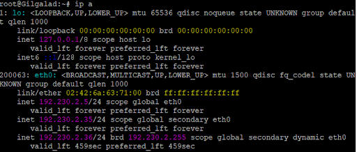
#Amandil harus mendapat IP di rentang 192.230.1.x.
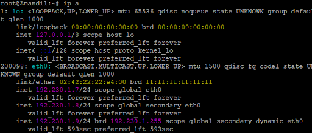
#Khamul harus mendapat IP tepat 192.230.3.95.
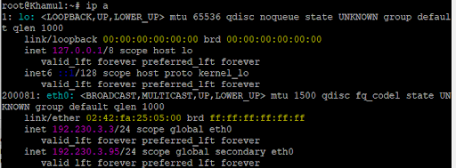

# Soal 3

## Bagian 1: Konfigurasi Minastir (DNS Filter)

Di terminal Minastir (192.230.5.2):

1. Instal BIND9

```
apt update
apt install bind9 dnsutils
```

2. Konfigurasi named.conf.options

```
nano /etc/bind/named.conf.options
```

Hapus semua isinya dan ganti dengan ini:

```
// Buat daftar izin untuk semua jaringan internal kita
acl "internal-nets" {
    192.230.1.0/24;
    192.230.2.0/24;
    192.230.3.0/24;
    192.230.4.0/24;
    192.230.5.0/24;
    localhost;
    localnets;
};

options {
    directory "/var/cache/bind";

    // Izinkan query dari jaringan internal
    allow-query { internal-nets; };

    // Izinkan recursive query dari jaringan internal
    allow-recursion { internal-nets; };
    recursion yes;

    // Kirim query yang tidak diketahui ke DNS Google
    forwarders {
        8.8.8.8;
        8.8.4.4;
    };

    dnssec-validation auto;

    // Dengarkan di semua interface
    listen-on { any; };
    listen-on-v6 { any; };
};
```

3. Jalankan BIND9 (Manual)

```
named-checkconf

# Jalankan servernya
# Pakai -4 untuk menghindari error IPv6
named -g -4
```

## Bagian 2: Konfigurasi Durin (Router & Polisi)

Di terminal Durin:

1. Aktifkan IP Forwarding

```
echo 1 > /proc/sys/net/ipv4/ip_forward
```

2. Jalankan DHCP Relay (Soal 2)

```
dhcrelay -i eth1 -i eth2 -i eth3 -i eth4 192.230.4.3 &
```

3. Terapkan Aturan iptables (Soal 3 Baru)
   A. Aturan NAT (Izinkan SEMUA ke Internet).

```
iptables -t nat -A POSTROUTING -s 192.230.1.0/24 -o eth0 -j MASQUERADE
iptables -t nat -A POSTROUTING -s 192.230.2.0/24 -o eth0 -j MASQUERADE
iptables -t nat -A POSTROUTING -s 192.230.3.0/24 -o eth0 -j MASQUERADE
iptables -t nat -A POSTROUTING -s 192.230.4.0/24 -o eth0 -j MASQUERADE
iptables -t nat -A POSTROUTING -s 192.230.5.0/24 -o eth0 -j MASQUERADE
```

B. Aturan Redirect DNS (Belokkan ke Minastir).

```
# --- Jaringan 1 (eth1) ---
iptables -t nat -A PREROUTING -i eth1 -p udp --dport 53 -j DNAT --to-destination 192.230.5.2
iptables -t nat -A PREROUTING -i eth1 -p tcp --dport 53 -j DNAT --to-destination 192.230.5.2

# --- Jaringan 2 (eth2) ---
iptables -t nat -A PREROUTING -i eth2 -p udp --dport 53 -j DNAT --to-destination 192.230.5.2
iptables -t nat -A PREROUTING -i eth2 -p tcp --dport 53 -j DNAT --to-destination 192.230.5.2

# --- Jaringan 3 (eth3) ---
iptables -t nat -A PREROUTING -i eth3 -p udp --dport 53 -j DNAT --to-destination 192.230.5.2
iptables -t nat -A PREROUTING -i eth3 -p tcp --dport 53 -j DNAT --to-destination 192.230.5.2

# --- Jaringan 4 (eth4) ---
iptables -t nat -A PREROUTING -i eth4 -p udp --dport 53 -j DNAT --to-destination 192.230.5.2
iptables -t nat -A PREROUTING -i eth4 -p tcp --dport 53 -j DNAT --to-destination 192.230.5.2

# === UDP ===
# ATURAN 1: Izinkan Minastir (192.230.5.2) lewat tanpa dibelokkan
iptables -t nat -A PREROUTING -i eth5 -s 192.230.5.2 -p udp --dport 53 -j RETURN

# ATURAN 2: Belokkan semua DNS (UDP) lainnya
iptables -t nat -A PREROUTING -i eth5 -p udp --dport 53 -j DNAT --to-destination 192.230.5.2

# === TCP ===
# ATURAN 1: Izinkan Minastir (192.230.5.2) lewat tanpa dibelokkan
iptables -t nat -A PREROUTING -i eth5 -s 192.230.5.2 -p tcp --dport 53 -j RETURN

# ATURAN 2: Belokkan semua DNS (TCP) lainnya
iptables -t nat -A PREROUTING -i eth5 -p tcp --dport 53 -j DNAT --to-destination 192.230.5.2
```

C. Aturan Firewall FORWARD Kita harus izinkan paketnya melintas.

```
# Izinkan SEMUA internal ke internet
iptables -A FORWARD -i eth1 -o eth0 -j ACCEPT
iptables -A FORWARD -i eth2 -o eth0 -j ACCEPT
iptables -A FORWARD -i eth3 -o eth0 -j ACCEPT
iptables -A FORWARD -i eth4 -o eth0 -j ACCEPT
iptables -A FORWARD -i eth5 -o eth0 -j ACCEPT

# Izinkan BALASAN dari internet
iptables -A FORWARD -i eth0 -m state --state RELATED,ESTABLISHED -j ACCEPT
```

Bagian 3: Pengujian (di Klien)
Pindah ke Gilgalad (atau klien lain).
Dapatkan IP:

```
dhclient -v eth0

```

Tes Ping (Harus BERHASIL)

```

ping 8.8.8.8
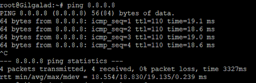

```

Tes DNS (Pembelokan).

```

cat /etc/resolv.conf

```

```

dig google.com

```

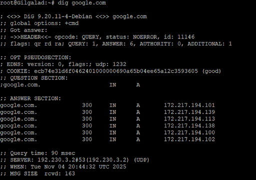

# Soal 4

Pada soal ini, kita diminta untuk mengatur DNS Master-Slave.

Erendis (Master): Lo harus konfig dia jadi server DNS utama. Bikin "peta" (zone file) baru bernama K38.com.

Isi Peta: Di dalem peta itu, lo harus daftarin nama ns1 (Erendis) dan ns2 (Amdir), plus nama-nama host penting (Palantir, Elros, Elendil, dll.) beserta IP address mereka.

Amdir (Slave): Lo harus konfig dia biar otomatis menyalin peta (K38.com) dari Erendis.

```
# Di terminal Durin
# Hapus semua aturan pembelokan (PREROUTING)
iptables -t nat -F PREROUTING
```

## Konfigurasi Erendis (Master Server)

Di terminal Erendis (192.230.3.2):
a. Instal BIND9 (Jika Hilang)

```
apt update
apt install bind9 dnsutils -y
```

b. Konfigurasi Opsi (named.conf.options)

```
nano /etc/bind/named.conf.options
```

Isi file ini seperti ini:

```
// Buat daftar izin untuk semua jaringan internal kita
acl "internal-nets" {
    192.230.1.0/24;
    192.230.2.0/24;
    192.230.3.0/24;
    192.230.4.0/24;
    192.230.5.0/24;
    localhost;
    localnets;
};

options {
    directory "/var/cache/bind";

    // Izinkan query & rekursi dari jaringan internal
    allow-query { internal-nets; };
    allow-recursion { internal-nets; };
    recursion yes;

    // Kirim query yang tidak diketahui ke DNS Google
    forwarders {
        8.8.8.8;
        8.8.4.4;
    };

    dnssec-validation auto;
    listen-on { any; };
    listen-on-v6 { none; }; // Paksa IPv4
};
```

c. Daftarkan Peta (Zone) Baru (named.conf.local)

```
nano /etc/bind/named.conf.local
```

Tambahkan ini di bagian bawah file:

```
// Zona utama K38.com
zone "K38.com" {
    type master;
    file "/etc/bind/db.K38.com";  // File peta (zone file) kita
    allow-transfer { 192.230.4.2; }; // Izinkan Amdir (IP Slave) menyalin
};
```

d. Buat File Peta (db.K38.com).

```
nano /etc/bind/db.K38.com
```

Isi dengan ini (ganti K38 dan pastikan IP-nya benar):

```
;
; BIND data file for K38.com
;
$TTL    604800
@       IN      SOA     ns1.K38.com. root.K38.com. (
                              1         ; Serial (PENTING!)
                         604800         ; Refresh
                          86400         ; Retry
                        2419200         ; Expire
                         604800 )       ; Negative Cache TTL
;
; === Name Servers (NS Records) ===
@       IN      NS      ns1.K38.com.
@       IN      NS      ns2.K38.com.

; === Name Server IPs (A Records) ===
ns1     IN      A       192.230.3.2     ; IP Erendis (Master)
ns2     IN      A       192.230.4.2     ; IP Amdir (Slave)

; === Host Records (A Records) ===
palantir  IN      A       192.230.4.5
elros     IN      A       192.230.1.5
pharazon  IN      A       192.230.4.6
elendil   IN      A       192.230.1.2
isildur   IN      A       192.230.1.3
anarion   IN      A       192.230.1.4
galadriel IN      A       192.230.2.3
celeborn  IN      A       192.230.2.4
oropher   IN      A       192.230.2.5
```

e. Cek & Jalankan

```
# Cek config
named-checkconf

# Cek file peta (ganti K38)
named-checkzone K38.com /etc/bind/db.K38.com

named -g -4
```

3. Konfigurasi Amdir (Slave Server)
   Di terminal Amdir (192.230.4.2):
   a. Instal BIND9 (Jika Hilang)

```
apt update
apt install bind9 dnsutils -y
```

b. Konfigurasi Opsi (named.conf.options).
c. Daftarkan Peta (Zone).

```
nano /etc/bind/named.conf.local
```

Tambahkan ini di bagian bawah file:

```
// Zona K38.com (disalin dari Master)
zone "K38.com" {
    type slave;
    file "db.K38.com";          // BIND akan otomatis menyimpan salinannya
    masters { 192.230.3.2; };  // Alamat IP Erendis (Master)
};
```

d. Cek & Jalankan

```
# Cek config
named-checkconf

# Jalankan (karena kita tahu /etc/init.d/ tidak ada)
named -g -4
```

4. Update Klien (via DHCP Aldarion)
   Di terminal Aldarion (192.230.4.3):
   a. Edit Konfigurasi DHCP

```
nano /etc/dhcp/dhcpd.conf
```

b. Ubah Opsi domain-name-servers Di bagian atas (Opsi Global)

```
option domain-name-servers 192.230.3.2, 192.230.4.2;
```

c. Restart DHCP Server

```
/etc/init.d/isc-dhcp-server restart
```

5. Verifikasi (di Klien)
   Pindah ke Gilgalad (atau klien dinamis lainnya).
   a. Minta IP & DNS Baru

```
dhclient -v eth0
```

b. Cek File DNS

```
cat /etc/resolv.conf
```

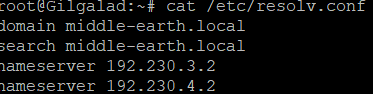

(Outputnya harus nameserver 192.230.3.2 dan nameserver 192.230.4.2).

c. Tes dig

```
# Tes internal (ganti K38)
dig elendil.K38.com

# Tes eksternal (rekursif)
dig google.com
```

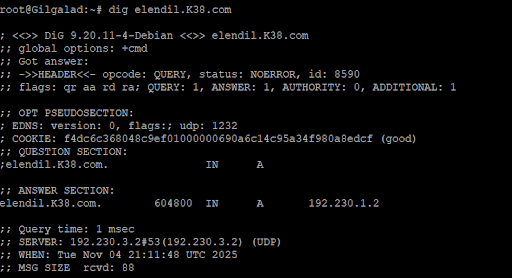

# Soal 5

Pada soal ini, kita diminta melengkapi server DNS Erendis (Master) yang udah kita buat di Soal 4.

Lo harus nambahin 3 hal di Erendis:

Alias www: Bikin alias (CNAME) biar www.<xxxx>.com nunjuk ke domain utamamu (<xxxx>.com).

Reverse PTR: Bikin "peta terbalik" (PTR) biar kalo orang ngecek IP-nya Erendis (192.230.3.2) dan Amdir (192.230.4.2), nama domain mereka (ns1 & ns2) bakal muncul.

Pesan Rahasia (TXT): Nambahin TXT record di elros ("Cincin Sauron") dan pharazon ("Aliansi Terakhir").

Amdir (Slave) bakal otomatis nyalin semua perubahan ini.

1. Node Erendis: Update Peta Utama (Forward Zone)
   Ini untuk menambah CNAME (www) dan TXT (pesan rahasia).
   a. Hentikan Server named Di terminal Erendis, tekan Ctrl + C untuk menghentikan named -g -4 yang lagi jalan.
   b. Edit File Peta (db.K38.com)

```
nano /etc/bind/db.K38.com
```

c. Lakukan 3 Perubahan (SERIAL, CNAME, TXT) File-mu akan terlihat seperti ini (lihat bagian SERIAL dan 2 blok tambahan di bawah):

```
;
; BIND data file for K38.com
;
$TTL    604800
@       IN      SOA     ns1.K38.com. root.K38.com. (
                              2         ; Serial (NAIKKAN JADI 2!)
                         604800         ; Refresh
                          86400         ; Retry
                        2419200         ; Expire
                         604800 )       ; Negative Cache TTL
;
; === Name Servers (NS Records) ===
@       IN      NS      ns1.K38.com.
@       IN      NS      ns2.K38.com.

; === Alias (CNAME) ===
www     IN      CNAME   @

; === Name Server IPs (A Records) ===
ns1     IN      A       192.230.3.2     ; IP Erendis (Master)
ns2     IN      A       192.230.4.2     ; IP Amdir (Slave)

; === Host Records (A Records) ===
palantir  IN      A       192.230.4.5
elros     IN      A       192.230.1.5
pharazon  IN      A       192.230.4.6
elendil   IN      A       192.230.1.2
isildur   IN      A       192.230.1.3
anarion   IN      A       192.230.1.4
galadriel IN      A       192.230.2.3
celeborn  IN      A       192.230.2.4
oropher   IN      A       192.230.2.5

; === Pesan Rahasia (TXT) ===
elros     IN      TXT     "Cincin Sauron"
pharazon  IN      TXT     "Aliansi Terakhir"
```

2. 📍 Node Erendis: Buat Peta Terbalik (Reverse Zone / PTR)
   Ini untuk melacak IP Erendis (...3.2) dan Amdir (...4.2)
   a. Daftarkan Reverse Zone Buka file konfigurasi utama BIND:

```
nano /etc/bind/named.conf.local
```

Tambahkan 2 blok zone baru ini di bagian bawah (ini untuk jaringan 192.230.3.x dan 192.230.4.x):

```
// Reverse zone untuk jaringan Erendis (192.230.3.x)
zone "3.230.192.in-addr.arpa" {
    type master;
    file "/etc/bind/db.192.230.3";
};

// Reverse zone untuk jaringan Amdir (192.230.4.x)
zone "4.230.192.in-addr.arpa" {
    type master;
    file "/etc/bind/db.192.230.4";
};
```

b. Buat File Peta Terbalik Kita perlu membuat 2 file baru yang kita daftarkan di atas.
File untuk Jaringan Erendis (...3.x)

```
nano /etc/bind/db.192.230.3
```

Isi dengan ini (PTR record 2 menunjuk ke IP .2 yaitu Erendis):

```
$TTL    604800
@       IN      SOA     ns1.K38.com. root.K38.com. (
                              1         ; Serial
                         604800         ; Refresh
                          86400         ; Retry
                        2419200         ; Expire
                         604800 )       ; Negative Cache TTL
;
@       IN      NS      ns1.K38.com.
;
; === PTR Records ===
2       IN      PTR     ns1.K38.com. ; (192.230.3.2)
```

File untuk Jaringan Amdir (...4.x)

```
nano /etc/bind/db.192.230.4
```

Isi dengan ini (PTR record 2 menunjuk ke IP .2 yaitu Amdir):

```
$TTL    604800
@       IN      SOA     ns1.K38.com. root.K38.com. (
                              1         ; Serial
                         604800         ; Refresh
                          86400         ; Retry
                        2419200         ; Expire
                         604800 )       ; Negative Cache TTL
;
@       IN      NS      ns1.K38.com.
;
; === PTR Records ===
2       IN      PTR     ns2.K38.com. ; (192.230.4.2)
```

3. Node Erendis: Cek & Jalankan Ulang
   a. Cek Semua Konfigurasi:

```
# Cek config utama
named-checkconf

# Cek peta utama (forward)
named-checkzone K38.com /etc/bind/db.K38.com

# Cek peta terbalik (reverse)
named-checkzone 3.230.192.in-addr.arpa /etc/bind/db.192.230.3
named-checkzone 4.230.192.in-addr.arpa /etc/bind/db.192.230.4
```

(Pastikan semuanya OK).
b. Jalankan Ulang Server:

```
named -g -4
```

4. 📍 Node Gilgalad: Verifikasi
   Sekarang pindah ke terminal klien (seperti Gilgalad).
   a. Tes CNAME (Alias www):

```
dig www.K38.com
```

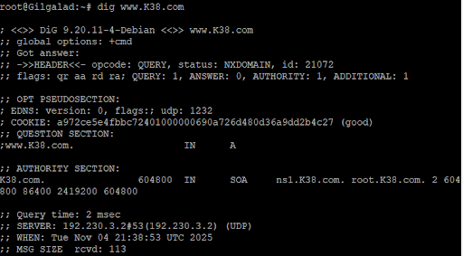

b. Tes TXT (Pesan Rahasia):

```
dig elros.K38.com TXT
```

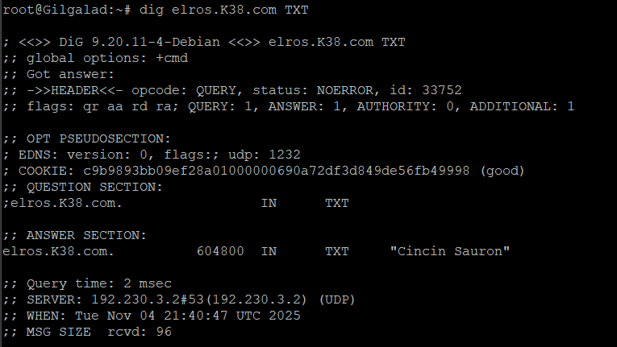

c. Tes PTR (Peta Terbalik):

```
# Tes IP Erendis
dig -x 192.230.3.2

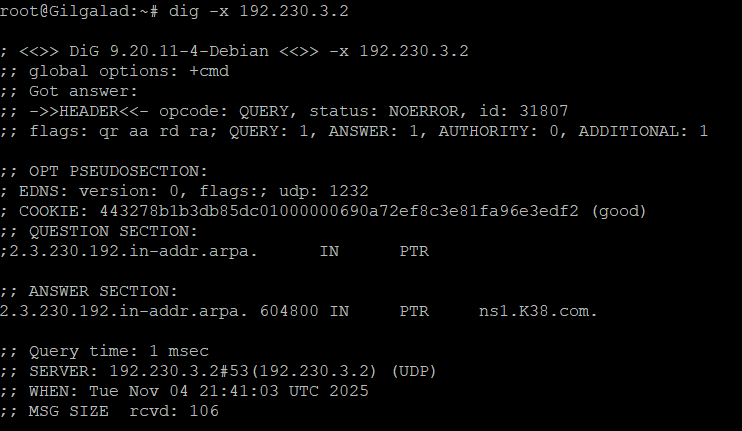

# Tes IP Amdir
dig -x 192.230.4.2
```

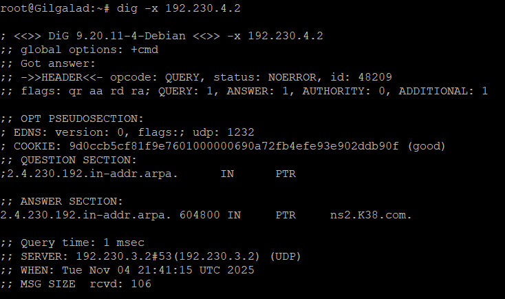

# Soal 6

Pada soal ini, kita diminta ngatur waktu sewa (lease time) di Aldarion (DHCP Server).

Lo harus edit file dhcpd.conf buat nambahin:

Jaringan Manusia (Jaringan 1): Waktu sewa (default-lease-time) jadi setengah jam (1800 detik).

Jaringan Peri (Jaringan 2): Waktu sewa (default-lease-time) jadi seperenam jam (600 detik).

Global: Waktu sewa maksimal (max-lease-time) untuk semua jaringan jadi satu jam (3600 detik).

Konfigurasi di Aldarion
Di terminal Aldarion (192.230.4.3):

1. Edit File dhcpd.conf

```
nano /etc/dhcp/dhcpd.conf
```

2. Lakukan 3 Perubahan
   A. Ubah max-lease-time (Global): Di bagian atas file (Opsi Global), cari max-lease-time dan ubah nilainya menjadi 3600.

```
# --- Opsi Global ---
...
default-lease-time 600;  # Biarkan ini atau hapus
max-lease-time 3600;     # <-- UBAH INI (dari 7200)
...
```

B. Tambahkan Waktu di Subnet Manusia (Jaringan 1): Cari blok subnet 192.230.1.0 dan tambahkan default-lease-time 1800; di dalamnya.

```
# --- Jaringan 1: Keluarga Manusia (via Durin eth1) ---
subnet 192.230.1.0 netmask 255.255.255.0 {
    option routers 192.230.1.1;
    default-lease-time 1800; # <-- TAMBAHKAN INI (1800 detik)

    # Rentang 1
    range 192.230.1.6 192.230.1.34;
    # Rentang 2
    range 192.230.1.68 192.230.1.94;
}
```

C. Tambahkan Waktu di Subnet Peri (Jaringan 2): Cari blok subnet 192.230.2.0 dan tambahkan default-lease-time 600;.

```
# --- Jaringan 2: Keluarga Peri (via Durin eth2) ---
subnet 192.230.2.0 netmask 255.255.255.0 {
    option routers 192.230.2.1;
    default-lease-time 600; # <-- TAMBAHKAN INI (600 detik)

    # Rentang 1
    range 192.230.2.35 192.230.2.67;
    # Rentang 2
    range 192.230.2.96 192.230.2.121;
}
```

3. Restart DHCP Server
   Agar konfigurasi baru terbaca, restart layanannya (ingat, di image kamu, kita pakai /etc/init.d/):

```
/etc/init.d/isc-dhcp-server restart
```

# Soal 7

Pada soal ini, kita diminta nyiapin server buat aplikasi Laravel.

Lo harus masuk ke ketiga worker (Elendil, Isildur, Anarion) dan:

Instal semua tools yang dibutuhin: nginx, php8.4 (termasuk FPM), dan composer.

Download source code Laravel-nya (dari "Resource-laravel").

Terakhir, lo juga harus instal lynx di node klien (kayak Gilgalad) buat ngetes di soal-soal berikutnya.

Bagian 1: Instalasi Tools (Di 3 Ksatria)
Lakukan langkah-langkah ini di terminal Elendil, Isildur, DAN Anarion.
1.1. Instal Nginx, Composer, dan PHP

```
# 1. Update daftar paket
apt update

# 2. Instal Nginx, Composer, Git, dan PHP 8.4
# (Kita tambahkan php8.4-cli & ekstensi umum Laravel)
apt install nginx curl composer git php8.4-fpm php8.4-cli php8.4-mysql php8.4-mbstring php8.4-xml php8.4-curl php8.4-zip -y
```

1.2. Dapatkan Cetak Biru (Source Code)

```
# 1. Buat folder untuk web-nya
mkdir -p /var/www/benteng

# 2. Clone resource-nya (ganti <URL_GIT> dengan URL resource kamu)
git clone https://github.com/elshiraphine/laravel-simple-rest-api /var/www/benteng

# 3. Masuk ke folder & install dependensi Laravel
cd /var/www/benteng
composer install --no-dev
composer update
```

(Pastikan kamu lakukan ini di ketiga node Ksatria).
Bagian 2: Instalasi Lynx (Di Klien)
Sekarang pindah ke satu node Klien (misal Gilgalad atau Miriel) untuk menginstal lynx.

```
# Di terminal Gilgalad
apt update
apt install lynx -y
```

Bagian 3: Cek dengan Lynx
Ini adalah bagian testing dari soal. Kalau kamu coba sekarang:

```
# Di terminal Gilgalad
lynx elendil.K38.com
```

Hasilnya PASTI GAGAL atau akan nampilin halaman "Welcome to Nginx" (default).
Kenapa? Kita baru install Nginx, tapi kita belum mengkonfigurasi "benteng"-nya (Nginx server block) untuk menjalankan aplikasi Laravel di /var/www/benteng.

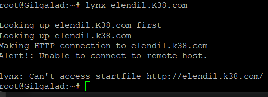

# Soal 8

Pada soal ini, kita diminta ngonfigurasi ketiga worker Laravel (Elendil, Isildur, Anarion) biar siap jalan:

Konek ke Database: Lo harus ngedit file .env di ketiga worker biar nyambung ke Palantir (Database Server).

Bikin Gerbang Unik: Lo harus ngatur Nginx di tiap worker biar "dengerin" di port yang beda-beda (8001, 8002, 8003) dan cuma mau nerima koneksi kalo diakses pake domain (bukan IP).

Inisialisasi Database: Lo harus ngejalanin php artisan migrate --seed dari Elendil buat ngebikin tabel dan ngisi data awal di Palantir.

Konfigurasi .env & Database
Langkah ini dilakuin di semua 3 worker (Elendil, Isildur, Anarion).

1. Masuk ke Direktori Benteng:

```
cd /var/www/benteng
```

2. Salin File .env & Buat Kunci:

   ```

   ```

# Salin dari file contoh

cp .env.example .env

# Generate kunci aplikasi Laravel

php artisan key:generate

```

##Buat Database

```

apt update
apt install mariadb-server

```
#Start Service MariaDB
```

/etc/init.d/mariadb start

```
# Cek Status
```

/etc/init.d/mariadb status

```
#Masuk ke MySQL
```

mysql

```
#Didalam mysql, buat database
-- 1. Buat database-nya
CREATE DATABASE db_benteng;

-- 2. Buat user-nya (pakai '%' biar bisa diakses dari Elendil dkk.)
CREATE USER 'user_benteng'@'%' IDENTIFIED BY 'jarkom_menyenangkan';

-- 3. Kasih user itu izin ke database baru
GRANT ALL PRIVILEGES ON db_benteng.* TO 'user_benteng'@'%';

-- 4. Terapkan perubahan
FLUSH PRIVILEGES;

-- 5. Keluar dari MariaDB
EXIT;
```

##konfigurasi di palantir (perizinan koneksi)

```
# Di terminal Palantir
nano /etc/mysql/mariadb.conf.d/50-server.cnf
```

Cari baris bind-address: Kamu akan lihat ini:

```
bind-address            = 0.0.0.0#ubah ini
```

(127.0.0.1 artinya "cuma dengerin localhost").
#restart

```
/etc/init.d/mariadb restart
```

3. Edit File .env: Buka editor-nya:

```
nano .env
```

Cari bagian DB_CONNECTION dan ubah biar konek ke Palantir (IP: 192.230.4.5):
DB_CONNECTION=mysql
DB_HOST=192.230.4.5
DB_PORT=3306
DB_DATABASE=db_benteng # (Ganti ini)
DB_USERNAME=user_benteng # (Ganti ini)
DB_PASSWORD=jarkom_menyenangkan # (Ganti ini)

(Pastikan kamu udah bikin database dan user-nya di node Palantir ya, bro).
8.3. Konfigurasi Nginx (Gerbang Unik)
Ini yang krusial. Tiap Ksatria punya gerbang (port) dan domain-nya sendiri.
A. Di Elendil (Port 8001)

1. Buka file konfigurasi Nginx:

```
nano /etc/nginx/sites-available/default
```

2.  Hapus semua isinya dan ganti dengan ini (ganti K38):

```
server {
    # Gerbang unik Elendil
    listen 8001;

    # Hanya jawab domain ini
    server_name elendil.K38.com;
    root /var/www/benteng/public;

    index index.php;

    location / {
        try_files $uri $uri/ /index.php?$query_string;
    }

    location ~ \.php$ {
        include snippets/fastcgi-php.conf;
        # Arahkan ke socket PHP 8.4
        fastcgi_pass unix:/var/run/php/php8.4-fpm.sock;
    }
}
```

B. Di Isildur (Port 8002)
Buka file: nano /etc/nginx/sites-available/default
Hapus semua isinya, ganti dengan config yang sama persis kayak Elendil, tapi UBAH 2 BARIS INI:

```
listen 8002; # Gerbang Isildur
    server_name isildur.K38.com;
```

C. Di Anarion (Port 8003)
Buka file: nano /etc/nginx/sites-available/default
Hapus semua isinya, ganti dengan config yang sama persis kayak Elendil, tapi UBAH 2 BARIS INI:

```
listen 8003; # Gerbang Anarion
    server_name anarion.K38.com;
```

8.4. Restart Service
Terakhir, restart Nginx dan PHP-FPM di semua 3 Ksatria (Elendil, Isildur, Anarion).

```
# (Jalankan di ketiga Ksatria)

# Restart Nginx
/etc/init.d/nginx restart

# Restart PHP-FPM
/etc/init.d/php8.4-fpm restart
```
# Soal 11: Benchmark dan Strategi Pertahanan Númenor
### Deskripsi Soal
Musuh mencoba menguji kekuatan pertahanan Númenor. Dari node client, luncurkan serangan benchmark (ab) ke elros.<xxxx>.com/api/airing/:

```bash 
Serangan Awal: -n 100 -c 10 (100 permintaan, 10 bersamaan)
Serangan Penuh: -n 2000 -c 100 (2000 permintaan, 100 bersamaan)
Pantau kondisi para worker dan periksa log Elros
Strategi Bertahan: Tambahkan weight dalam algoritma, kemudian catat apakah lebih baik atau tidak
```

## Implementasi
1. Persiapan di Node Client (Isildur/Amandil)
Sebelum melakukan benchmark, pastikan tools yang diperlukan sudah terinstall
### Install apache2-utils untuk tool ab
```bash 
apt-get update
apt-get install -y apache2-utils curl
```

### Verifikasi instalasi
```bash
ab -V
curl -V
```

### 2. Konfigurasi Awal Load Balancer (Elros)
File: /etc/nginx/nginx.conf atau /etc/nginx/sites-available/default
```bash 
nginxupstream kesatria_numenor {
    # Round Robin tanpa weight (default)
    server 10.15.3.1:8001;  # Elendil
    server 10.15.3.2:8002;  # Isildur
    server 10.15.3.3:8003;  # Anarion
}

server {
    listen 80;
    server_name elros.k38.com;

    location / {
        proxy_pass http://kesatria_numenor;
        proxy_set_header Host $host;
        proxy_set_header X-Real-IP $remote_addr;
        proxy_set_header X-Forwarded-For $proxy_add_x_forwarded_for;
    }
}
```

### Restart Nginx:
```bash
nginx -t
service nginx restart
```

### 📊 Eksekusi Benchmark
Tahap 1: Serangan Awal (Baseline)
Dari node client, jalankan benchmark ringan:
```bash
ab -n 100 -c 10 http://elros.k38.com/api/airing/
```

#### Penjelasan Parameter:
```bash 
-n 100: Total 100 requests
-c 10: 10 concurrent connections
```
Output disimpan untuk analisis
Hasil Serangan Awal:
```bash 
Requests per second:    3923.88 [#/sec]
Time per request:       2.549 [ms] (mean)
Failed requests:        79
Non-2xx responses:      100
Tahap 2: Serangan Penuh (Sebelum Weight)
Tingkatkan intensitas serangan:
bashab -n 2000 -c 100 http://elros.k38.com/api/airing/ > /tmp/ab_penuh_before.log 2>&1
Hasil Sebelum Weight:
Requests per second:    8214.02 [#/sec]
Time per request:       12.174 [ms] (mean)
Failed requests:        1978
Non-2xx responses:      2000
```

Observasi:
RPS meningkat signifikan ke 8214 req/s
Namun hampir semua request gagal (1978 failed)
Beban terdistribusi merata tapi worker kewalahan

### Tahap 3: Monitoring Worker
Cek resource usage di setiap worker:

#### Atau cek load via SSH
Cek log error di Elros:
```bash
tail -f /var/log/nginx/error.log
tail -f /var/log/nginx/access.log

Sample Log Error:
[error] upstream timed out
[warn] worker_connections exceeded
[error] connect() failed (111: Connection refused)
```

### Strategi Bertahan: Implementasi Weight
Modifikasi Upstream dengan Weight
Worker yang lebih powerful dapat diberi weight lebih besar untuk menangani beban lebih:
Updated Nginx Config:
```bash
nginxupstream kesatria_numenor {
    # Weighted Round Robin
    server 10.15.3.1:8001 weight=3;  # Elendil - 50% traffic
    server 10.15.3.2:8002 weight=2;  # Isildur - 33% traffic
    server 10.15.3.3:8003 weight=1;  # Anarion - 17% traffic
}

server {
    listen 80;
    server_name elros.k38.com;

    location / {
        proxy_pass http://kesatria_numenor;
        proxy_set_header Host $host;
        proxy_set_header X-Real-IP $remote_addr;
        proxy_set_header X-Forwarded-For $proxy_add_x_forwarded_for;
        
        # Connection settings untuk load balancing
        proxy_connect_timeout 60s;
        proxy_send_timeout 60s;
        proxy_read_timeout 60s;
    }
}
```

Reload Configuration:
```bash
nginx -t
nginx -s reload
```

### Tahap 4: Serangan Penuh (Setelah Weight)
```bash
ab -n 2000 -c 100 http://elros.k38.com/api/airing/ > /tmp/ab_penuh_after.log 2>&1
```

#### Hasil Setelah Weight:
Requests per second:    6272.23 [#/sec]
Time per request:       15.943 [ms] (mean)
Failed requests:        1978
Non-2xx responses:      2000
```bash 
+------------------------+----------------+---------------------+----------------+------------------+---------------------+
| Tahap                  | Perintah       | RPS                 | Failed Requests | Non-2xx Responses | Time/Req (ms)       |
+------------------------+----------------+---------------------+----------------+------------------+---------------------+
| Awal (Baseline)        | -n 100 -c 10  | 3923.88             | 79             | 100              | 2.549               |
| Penuh (Before Weight)  | -n 2000 -c 100| 8214.02             | 1978           | 2000             | 12.174              |
| Penuh (After Weight)   | -n 2000 -c 100| 6272.23             | 1978           | 2000             | 15.943              |
+------------------------+----------------+---------------------+----------------+------------------+---------------------+
```
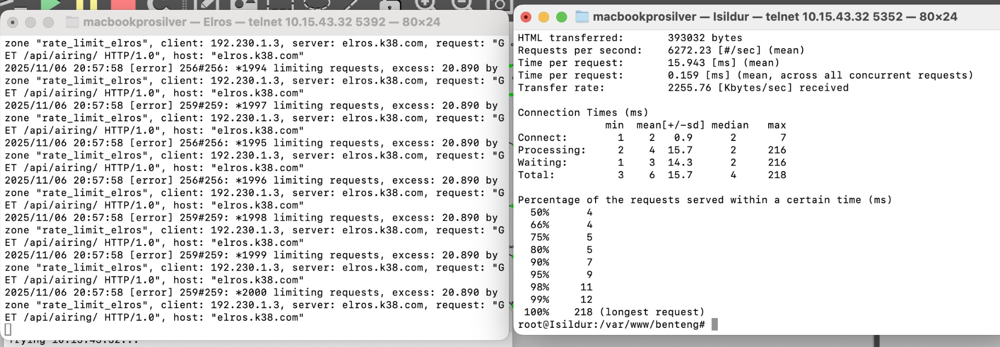

## Revisi

Dokumentasi
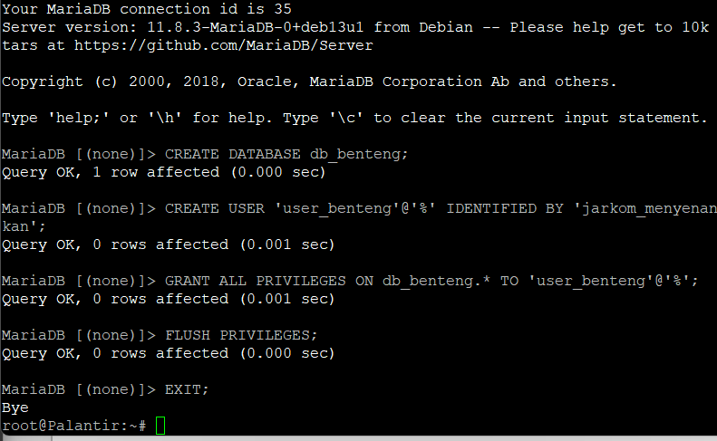

# Soal 12: Setup PHP Worker (Galadriel, Celeborn, Oropher)

## Deskripsi

Para Penguasa Peri membangun taman digital menggunakan PHP. Install nginx dan php8.4-fpm di setiap node worker PHP, buat index.php yang menampilkan hostname, dan akses hanya via domain name.

🔧 Solusi
Setup Script (setup-php-worker.sh)

### 1. Inisialisasi & DNS

```bash
#!/bin/bash
NODE_NAME=$(hostname)
NODE_IP=$(hostname -I | awk '{print $1}')

echo "nameserver 192.168.122.1" > /etc/resolv.conf
Auto-detect hostname dan IP
Fix DNS untuk install package
```

### 2. Install Dependencies

```bash
apt-get update -y
apt-get install -y nginx php php-fpm curl
Install nginx (web server)
Install php8.4-fpm (PHP processor)
```

### 3. Setup Web Directory

```bash
mkdir -p /var/www/html
chown -R www-data:www-data /var/www/html
chmod -R 755 /var/www/html
Buat direktori web
Set ownership ke user nginx (www-data)
```

### 4. Create index.php

```bash
echo "<?php echo 'Halo, saya $NODE_NAME di IP $NODE_IP!'; ?>" > /var/www/html/index.php
```

File PHP sederhana menampilkan hostname & IP
Setiap worker punya output unik

### 5. Configure Nginx

```bash
cat > /etc/nginx/sites-available/default << 'EOF'
server {
    listen 80 default_server;
    root /var/www/html;
    index index.php index.html;
    server_name _;

    location / {
        try_files $uri $uri/ /index.php?$query_string;
    }

    location ~ \.php$ {
        include snippets/fastcgi-php.conf;
        fastcgi_pass unix:/run/php/php8.4-fpm.sock;
    }

    location ~ /\.ht {
        deny all;
    }
}
EOF
```

### Penjelasan:

```bash
listen 80: Port HTTP
server_name _: Accept all hostnames
location ~ \.php$: Forward PHP ke PHP-FPM via unix socket
fastcgi_pass unix:/run/php/php8.4-fpm.sock: Communication channel
```

### 6. Restart Services

```bash
nginx -t
service php8.4-fpm restart
service nginx restart
Validate config dulu
Restart PHP-FPM & Nginx
```

### 📝 Testing

```bash
lynx http://galadriel
lynx http://celeborn
lynx http://oropher
```

**Expected Output:**

```bash
Halo, saya Galadriel di IP 10.15.3.4!
```

.png>)

.png>)

.png>)

# Soal 13: Konfigurasi Port PHP Workers

## Deskripsi

Setiap taman Peri harus dapat diakses di port yang berbeda:
Galadriel: Port 8004
Celeborn: Port 8005
Oropher: Port 8006

Konfigurasikan nginx untuk meneruskan request PHP ke php-fpm.

### Solusi

Script Galadriel (setup-galadriel.sh)

#### 1. Install Dependencies

```bash
echo "[1/7] Update & Install paket..."
apt update -y
apt install -y nginx php8.4-fpm lynx curl
```

#### 2. Start Services

```bash
/etc/init.d/php8.4-fpm start
/etc/init.d/nginx start
```

Menggunakan init.d karena systemctl mungkin tidak tersedia di container

#### 3. Create index.php

```bash
mkdir -p /var/www/html
echo "<?php echo 'Halo dari Galadriel'; ?>" > /var/www/html/index.php
```

File PHP sederhana untuk identifikasi worker

#### 4. Configure Nginx - Port 8004

```bash
cat > /etc/nginx/sites-available/default <<'EOF'
server {
    listen 8004;
    server_name galadriel.k38.com;
    root /var/www/html;
    index index.php index.html index.htm;

    location / {
        try_files $uri $uri/ /index.php?$query_string;
    }

    location ~ \.php$ {
        include snippets/fastcgi-php.conf;
        fastcgi_pass unix:/var/run/php/php8.4-fpm.sock;
    }

    location ~ /\.ht {
        deny all;
    }
}
EOF
```

```bash
listen 8004: Port khusus Galadriel
server_name galadriel.k38.com: Domain specific
fastcgi_pass unix:/var/run/php/php8.4-fpm.sock: PHP handler
```

#### 5. Validate & Restart

Uji konfigurasi Nginx..."

```bash
nginx -t
echo "[6/7] Restart Nginx..."
/etc/init.d/nginx restart
```

#### 6. Local Testing

```bash
lynx http://localhost:8004
```

"Galadriel PHP server aktif di port 8004."

#### Script Celeborn (setup-celeborn.sh)

Perbedaan dari Galadriel:

```bash
listen 8005;
server_name celeborn.k38.com;

# index.php
echo "<?php echo 'Halo dari Celeborn'; ?>" > /var/www/html/index.php

# Testing
lynx -dump http://localhost:8005 || curl -s http://localhost:8005
```

### Script Oropher (setup-oropher.sh)

Perbedaan dari Galadriel:

```bash
listen 8006;
server_name oropher.k38.com;

# index.php
echo "<?php echo 'Halo dari Oropher'; ?>" > /var/www/html/index.php
```

#### 📝 Testing

```bash
lynx http://galadriel:8004 || curl http://galadriel:8004
lynx http://celeborn:8005 || curl http://celeborn:8005
lynx http://oropher:8006 || curl http://oropher:8006
```

### 📊 Expected Output

| Worker    | Port | URL                     | Output                |
| --------- | ---- | ----------------------- | --------------------- |
| Galadriel | 8004 | `http://galadriel:8004` | `Halo dari Galadriel` |
| Celeborn  | 8005 | `http://celeborn:8005`  | `Halo dari Celeborn`  |
| Oropher   | 8006 | `http://oropher:8006`   | `Halo dari Oropher`   |

**Gambar 1**
.png>)

**Gambar 2**
.png>)

**Gambar 3**
.png>)

# Soal 14: Basic HTTP Authentication

### 📋 Deskripsi

Keamanan adalah prioritas. Terapkan Basic HTTP Authentication pada nginx di setiap worker PHP, sehingga hanya mereka yang tahu kata sandi yang bisa masuk.
Username: `bash noldor`
Password: `bash silvan`

### 🔧 Solusi

Prerequisite: Setup /etc/hosts di Client
Tambahkan di setiap client (Miriel, Amandil, dll):

```bash
nano /etc/hosts

# Tambahkan:
192.230.2.3  galadriel.k38.com
192.230.2.4  celeborn.k38.com
192.230.2.5  oropher.k38.com
```

Mapping IP ke domain untuk DNS resolution

### Script Galadriel (setup-galadriel-auth.sh)

#### 1. Install Dependencies

```bash
#!/bin/bash
echo "[1/8] Update Repository..."
apt update -y

echo "[2/8] Install Nginx, PHP, dan utilitas..."
apt install nginx php8.4-fpm php8.4-cli php8.4-common php8.4-mysql apache2-utils -y
apache2-utils: Package yang berisi htpasswd command

2. Start PHP-FPM
bash
echo "[3/8] Pastikan PHP-FPM aktif..."
systemctl enable php8.4-fpm
systemctl restart php8.4-fpm

3. Setup Web Directory
bash
echo "[4/8] Setup Web Root..."
mkdir -p /var/www/html
echo "<?php echo 'Halo dari Galadriel'; ?>" > /var/www/html/index.php
chown -R www-data:www-data /var/www/html
chmod -R 755 /var/www/html

4. Create Basic Auth File
bash
echo "[5/8] Buat Basic Auth..."
htpasswd -bc /etc/nginx/.htpasswd noldor silvan
Penjelasan:
htpasswd: Tool untuk membuat password file
-b: Batch mode (password dari command line)
-c: Create new file
/etc/nginx/.htpasswd: Lokasi file password
noldor silvan: username dan password

5. Configure Nginx dengan Auth
bash
echo "[6/8] Konfigurasi Nginx..."
cat > /etc/nginx/sites-available/default <<'EOF'
server {
    listen 8004;
    server_name galadriel.k38.com;

    root /var/www/html;
    index index.php index.html index.htm;

    # Basic Auth
    auth_basic "Restricted Access";
    auth_basic_user_file /etc/nginx/.htpasswd;

    location / {
        try_files $uri $uri/ /index.php?$query_string;
    }

    location ~ \.php$ {
        include snippets/fastcgi-php.conf;
        fastcgi_pass unix:/run/php/php8.4-fpm.sock;
        include fastcgi_params;
        fastcgi_param SCRIPT_FILENAME $document_root$fastcgi_script_name;
    }

    # Blokir akses via IP langsung
    if ($host ~* "^\d+\.\d+\.\d+\.\d+$") {
        return 403;
    }

    access_log /var/log/nginx/galadriel.access.log;
    error_log /var/log/nginx/galadriel.error.log;
}
EOF
Key Directives:
auth_basic "Restricted Access": Enable auth dengan message
auth_basic_user_file /etc/nginx/.htpasswd: Path ke password file
if ($host ~* "^\d+\.\d+\.\d+\.\d+$"): Blokir akses via IP
```

#### 6. Restart Services

```bash
echo "[7/8] Tes dan Restart Service..."
nginx -t && service nginx restart && service php8.4-fpm restart

echo "[8/8] Setup selesai!"
echo "Uji akses pakai: curl -u noldor:silvan http://galadriel.k38.com:8004"
```

#### Script Celeborn (setup-celeborn-auth.sh)

Perbedaan dari Galadriel:

```bash
# Port 8005
listen 8005;
server_name celeborn.k38.com;

# index.php
echo "<?php echo 'Halo dari Celeborn'; ?>" > /var/www/html/index.php

# Logs
access_log /var/log/nginx/celeborn.access.log;
error_log /var/log/nginx/celeborn.error.log;
```

#### Script Oropher (setup-oropher-auth.sh)

Dengan Error Handling:

```bash
#!/bin/bash
set -e  # Berhenti kalau ada error fatal

echo "[1/8] Update Repository..."
if ! apt update -y; then
    echo "❌ Gagal update repository!"
    ps aux | grep apt
    exit 1
fi

echo "[2/8] Install Nginx, PHP, dan utilitas..."
if ! apt install nginx php8.4-fpm apache2-utils -y; then
    echo "❌ Instalasi gagal. Pastikan tidak ada apt yang terkunci."
    exit 1
fi

echo "[3/8] Jalankan PHP-FPM..."
service php8.4-fpm start || true
service php8.4-fpm restart || true

echo "[5/8] Buat Basic Auth..."
htpasswd -bc /etc/nginx/.htpasswd noldor silvan || {
    echo "❌ Gagal membuat file .htpasswd"
    exit 1
}

# Config sama dengan port 8006
Improvements:
set -e: Exit on error
Error checking untuk setiap command critical
Fallback untuk service commands
```

#### 📝 Testing dari Client (Miriel)

Test dengan lynx:

```bash
lynx -auth=noldor:silvan http://galadriel:8004
lynx -auth=noldor:silvan http://celeborn:8005
lynx -auth=noldor:silvan http://oropher:8006
Test tanpa authentication (akan ditolak):
```

#### Output: 401 Unauthorized

### 📊 Expected Output

```bash
**Dengan Auth:**
Halo dari Galadriel
Tanpa Auth:
html
<html>
<head><title>401 Authorization Required</title></head>
<body>
<center><h1>401 Authorization Required</h1></center>
</body>
</html>
```

**Gambar 1**
.png>)

**Gambar 2**
.png>)

**Gambar 3**
.png>)

# Soal 15: X-Real-IP Header untuk Tracking Pengunjung

### 📋 Deskripsi

Para Peri ingin tahu siapa yang mengunjungi taman mereka. Modifikasi konfigurasi Nginx di worker PHP untuk:
Menambahkan header X-Real-IP yang diteruskan ke PHP
Ubah index.php untuk menampilkan alamat IP pengunjung asli

#### 🔧 Solusi

Script Galadriel (setup-galadriel-realip.sh)
1-3. Setup Awal (sama seperti soal 14)

```bash
#!/bin/bash
set -e

echo "[1/8] Update Repository..."
apt update -y

echo "[2/8] Install Nginx, PHP, dan utilitas..."
apt install nginx php8.4-fpm php8.4-cli apache2-utils -y

echo "[3/8] Pastikan PHP-FPM aktif..."
service php8.4-fpm start || true
service php8.4-fpm restart || true

4. Create Enhanced index.php
bash
echo "[4/8] Setup Web Root..."
mkdir -p /var/www/html
cat > /var/www/html/index.php <<'EOF'
<?php
$ip = $_SERVER['REMOTE_ADDR'];
if (!empty($_SERVER['HTTP_X_REAL_IP'])) {
    $ip = $_SERVER['HTTP_X_REAL_IP'];
}
echo "Halo dari Galadriel!<br>";
echo "Alamat IP pengunjung: " . htmlspecialchars($ip);
?>
EOF
chown -R www-data:www-data /var/www/html
chmod -R 755 /var/www/html
Penjelasan PHP:
$_SERVER['REMOTE_ADDR']: IP default dari koneksi langsung
$_SERVER['HTTP_X_REAL_IP']: IP asli dari header (jika ada)
htmlspecialchars(): Escape HTML untuk keamanan
Prioritas: Cek X-Real-IP dulu, fallback ke REMOTE_ADDR

5. Create Basic Auth
bash
echo "[5/8] Buat Basic Auth..."
htpasswd -bc /etc/nginx/.htpasswd noldor silvan

6. Configure Nginx dengan X-Real-IP
bash
echo "[6/8] Konfigurasi Nginx..."
cat > /etc/nginx/sites-available/default <<'EOF'
server {
    listen 8004;
    server_name galadriel.k38.com;

    root /var/www/html;
    index index.php index.html index.htm;

    auth_basic "Restricted Access";
    auth_basic_user_file /etc/nginx/.htpasswd;

    location / {
        try_files $uri $uri/ /index.php?$query_string;
    }

    location ~ \.php$ {
        include snippets/fastcgi-php.conf;
        fastcgi_pass unix:/run/php/php8.4-fpm.sock;
        include fastcgi_params;
        fastcgi_param SCRIPT_FILENAME $document_root$fastcgi_script_name;
        fastcgi_param HTTP_X_REAL_IP $remote_addr;
    }

    if ($host ~* "^\d+\.\d+\.\d+\.\d+$") {
        return 403;
    }

    access_log /var/log/nginx/galadriel.access.log;
    error_log /var/log/nginx/galadriel.error.log;
}
EOF
Key Addition:
nginx
fastcgi_param HTTP_X_REAL_IP $remote_addr;
Penjelasan:
$remote_addr: Variabel Nginx berisi IP client
fastcgi_param HTTP_X_REAL_IP: Pass ke PHP sebagai $_SERVER['HTTP_X_REAL_IP']
Header otomatis ditambahkan ke setiap request PHP

7-8. Restart & Validate
bash
echo "[7/8] Tes dan Restart Service..."
if nginx -t; then
    service nginx restart
    service php8.4-fpm restart
else
    echo "Konfigurasi Nginx bermasalah."
    exit 1
fi

echo "[8/8] Setup selesai."
echo "Akses: curl -u noldor:silvan http://galadriel.k38.com:8004"
```

#### Script Celeborn (setup-celeborn-realip.sh)

Perbedaan:

```bash
# Port 8005
listen 8005;
server_name celeborn.k38.com;

# index.php
echo "Halo dari Celeborn!<br>";

# Logs
access_log /var/log/nginx/celeborn.access.log;
error_log /var/log/nginx/celeborn.error.log;

Script Oropher (setup-oropher-realip.sh)
Perbedaan:
bash
# Port 8006
listen 8006;
server_name oropher.k38.com;

# index.php
echo "Halo dari Oropher!<br>";

# Logs
access_log /var/log/nginx/oropher.access.log;
error_log /var/log/nginx/oropher.error.log;

Script Client Miriel (setup-miriel.sh)
bash
#!/bin/bash
echo "[1/3] Set nameserver..."
echo "nameserver 192.168.122.1" > /etc/resolv.conf

echo "[2/3] Mapping domain ke IP worker..."
cat >> /etc/hosts <<'EOF'
192.230.2.3 galadriel.k38.com
192.230.2.4 celeborn.k38.com
192.230.2.5 oropher.k38.com
EOF

echo "[3/3] Tes koneksi ke semua worker..."
curl -u noldor:silvan http://galadriel.k38.com:8004
curl -u noldor:silvan http://celeborn.k38.com:8005
curl -u noldor:silvan http://oropher.k38.com:8006
```

Penjelasan:
Setup DNS resolver
Mapping domain ke IP static worker
Test koneksi ke semua worker dengan auth

#### 📝 Testing

Test dengan lynx:

```bash
lynx -auth=noldor:silvan http://galadriel:8004
lynx -auth=noldor:silvan http://celeborn:8005
lynx -auth=noldor:silvan http://oropher:8006
```

---

### 📊 Expected Output

**Dari Miriel (IP: 192.230.1.10):**

```bash
Halo dari Galadriel!
Alamat IP pengunjung: 192.230.1.10
```

**Gambar 1**
.png>)

**Gambar 2**
.png>)

**Gambar 3**
.png>)

# Soal 16 -Reverse Proxy Pharazon ke Peri Workers

#### 📋 Deskripsi

Pharazon dikonfigurasi sebagai reverse proxy untuk tiga PHP worker milik Peri: Galadriel (8004), Celeborn (8005), dan Oropher (8006).
Tugasnya adalah meneruskan request dari client ke backend secara round robin, sambil mempertahankan Basic Auth dan X-Real-IP agar IP asli pengunjung tetap terbaca.

#### Solusi Singkat

```bash
apt update -y
apt install -y nginx apache2-utils curl
mkdir -p /var/www/html && echo "<h1>Pharazon Reverse Proxy</h1>" > /var/www/html/index.html

cat > /etc/nginx/sites-available/default <<'EOF'
upstream Kesatria_Lorien {
    server galadriel:8004;
    server celeborn:8005;
    server oropher:8006;
}
server {
    listen 80;
    server_name pharazon.k38.com;
    proxy_set_header Authorization $http_authorization;
    proxy_set_header X-Real-IP $remote_addr;
    proxy_set_header Host $host;
    location / { proxy_pass http://Kesatria_Lorien; }
}
EOF

nginx -t && service nginx restart
```

#### 🧪 Pengujian

Dari client
`bash curl -u noldor:silvan http://pharazon.k38.com`

Output bervariasi tergantung worker yang aktif, misalnya:
Halo dari Galadriel!

**Gambar 1**
.png>)

**Gambar 2**
.png>)

**Gambar 3**
.png>)

# Soal 17 - Benchmark & Failover Reverse Proxy Pharazon

#### 📋 Deskripsi

Pada soal ini dilakukan pengujian beban (benchmark) dan simulasi kegagalan (failover) pada Pharazon, yang bertugas sebagai reverse proxy menuju tiga PHP worker: Galadriel, Celeborn, dan Oropher.
Tujuannya untuk memastikan bahwa jika salah satu worker down, Pharazon tetap dapat meneruskan trafik ke worker lain tanpa menghentikan layanan.

#### 🔧 Solusi Singkat

Client Celebrimbor

```bash
set -e
apt update -y && apt install -y apache2-utils curl
echo "192.230.2.7 pharazon.k38.com" >> /etc/hosts

# PHASE 1 – Semua worker aktif
echo "=== PHASE 1: Semua Worker Hidup ==="
for i in {1..15}; do curl -s -u noldor:silvan http://pharazon.k38.com/; echo "---"; done
ab -n 1000 -c 50 -A noldor:silvan http://pharazon.k38.com/

# PHASE 2 – Galadriel down
echo "[!] Stop nginx di Galadriel"
read -p "Tekan ENTER setelah Galadriel dimatikan..."
for i in {1..15}; do curl -s -u noldor:silvan http://pharazon.k38.com/; echo "---"; done
ab -n 1000 -c 50 -A noldor:silvan http://pharazon.k38.com/

# PHASE 3 – Recovery
echo "[!] Start nginx di Galadriel"
read -p "Tekan ENTER setelah Galadriel dihidupkan..."
for i in {1..15}; do curl -s -u noldor:silvan http://pharazon.k38.com/; echo "---"; done
```

## 🧪 Tahapan Pengujian

#### Phase 1 – Normal (Semua Worker Aktif)

Perintah:

```bash
for i in {1..20}; do curl -s -u noldor:silvan http://pharazon/; echo "---"; done
ab -n 500 -c 30 -A noldor:silvan http://pharazon/
```

#### Hasil:

Respons bergantian dari Galadriel, Celeborn, dan Oropher → load balancing berfungsi (round robin).

### Phase 2 – Worker Galadriel Down

Matikan Nginx di Galadriel:

```bash
service nginx stop
```

Ulangi test:

```bash
for i in {1..20}; do curl -s -u noldor:silvan http://pharazon/; echo "---"; done
ab -n 500 -c 30 -A noldor:silvan http://pharazon/
```

#### Hasil:

````bash
Response hanya dari Celeborn dan Oropher. Pharazon tetap melayani request tanpa error fatal. Di log Pharazon (/var/log/nginx/error.log) muncul:

 connect() failed (111: Connection refused) while connecting to upstream, server: galadriel:8004

#### Phase 3 – Recovery
Hidupkan kembali Galadriel:
```bash
service nginx start
```bash

Tes ulang:
```bash
for i in {1..20}; do curl -s -u noldor:silvan http://pharazon/; echo "---"; done
````

#### Hasil:

Galadriel kembali muncul dalam rotasi load balancing — sistem berhasil recovery otomatis.

**Gambar 1**
.png>)

**Gambar 2**
.png>)

# Soal 18 - Replikasi Database MariaDB (Palantir – Narvi)

## 📋 Deskripsi

Tugas nomor 18 adalah mengonfigurasi replikasi database MariaDB dengan Palantir sebagai Master dan Narvi sebagai Slave.
Tujuannya agar setiap perubahan data di Master otomatis tersalin ke Slave, menjaga sinkronisasi dan redundansi data antara dua server database.

### 🔧 Konfigurasi

```bash
1️⃣ Palantir (Master)
Script utama:
mariadbd --user=mysql \
--datadir=/var/lib/mysql \
--socket=/var/run/mysqld/mysqld.sock \
--bind-address=0.0.0.0 \
--server-id=1 \
--log-bin=/var/log/mysql/mysql-bin.log &

Lalu buat database & user replikasi:

CREATE DATABASE jarkom;
CREATE USER 'repl'@'%' IDENTIFIED BY 'repl123';
GRANT REPLICATION SLAVE ON *.* TO 'repl'@'%';
FLUSH PRIVILEGES;
SHOW MASTER STATUS;
```

📌 Catat File dan Position dari hasil SHOW MASTER STATUS untuk digunakan di Slave.

```bash
2️⃣ Narvi (Slave)
Menjalankan MariaDB dengan ID berbeda:
mariadbd --user=mysql \
--datadir=/var/lib/mysql \
--socket=/var/run/mysqld/mysqld.sock \
--bind-address=0.0.0.0 \
--server-id=2 &

Lalu hubungkan ke Master:
STOP SLAVE;
RESET SLAVE ALL;
CHANGE MASTER TO
  MASTER_HOST='192.230.4.5',
  MASTER_USER='repl',
  MASTER_PASSWORD='repl123',
  MASTER_LOG_FILE='mysql-bin.000011',
  MASTER_LOG_POS=1413;
START SLAVE;
SHOW SLAVE STATUS\G
```

✅ Pastikan Slave_IO_Running: Yes dan Slave_SQL_Running: Yes.

### Pengujian

Di Palantir:

```bash
USE jarkom;
CREATE TABLE test2 (id INT AUTO_INCREMENT PRIMARY KEY, nama VARCHAR(255));
INSERT INTO test2 (nama) VALUES ('Frodo'), ('Samwise');
```

```bash
Di Narvi:
USE jarkom;
SHOW TABLES;
SELECT * FROM test2;
```

📈 Hasil: tabel test2 dan isinya otomatis muncul di Narvi → replikasi berhasil.

**Gambar 1**
.png>)


# Soal 19 - Rate Limiting pada Load Balancer
### Deskripsi
Gelombang serangan dari Mordor semakin intens. Implementasikan rate limiting pada kedua Load Balancer (Elros dan Pharazon) menggunakan Nginx. Batasi agar satu alamat IP hanya bisa melakukan 10 permintaan per detik. Uji coba dengan menjalankan ab dari satu client dengan konkurensi tinggi (-c 50 atau lebih) dan periksa log Nginx untuk melihat pesan request yang ditolak atau ditunda karena rate limit.

### Solusi
#### 1. Setup Rate Limiting di ELROS
Script: /root/setup-elros-ratelimit.sh
```bash
apt update && apt install -y nginx
```

# Konfigurasi nginx.conf
```bash
cat > /etc/nginx/nginx.conf <<'EOF'
user www-data;
worker_processes auto;
pid /run/nginx.pid;

events {
    worker_connections 1024;
}

http {
    limit_req_zone $binary_remote_addr zone=rate_limit_elros:10m rate=10r/s;
    include /etc/nginx/mime.types;
    default_type application/octet-stream;
    sendfile on;
    keepalive_timeout 65;
    include /etc/nginx/sites-enabled/*;
}
EOF
```

### Site config
```bash
cat > /etc/nginx/sites-available/elros <<'EOF'
upstream kesatria_numenor {
    server elendil:8001;
    server isildur:8002;
    server anarion:8003;
}

server {
    listen 80;
    server_name elros.k38.com;

    location / {
        limit_req zone=rate_limit_elros burst=20 nodelay;
        proxy_pass http://kesatria_numenor;
        add_header X-RateLimit "10 req/s" always;
    }

    access_log /var/log/nginx/elros.access.log;
    error_log /var/log/nginx/elros.error.log;
}
EOF

ln -sf /etc/nginx/sites-available/elros /etc/nginx/sites-enabled/
nginx -t && nginx
```

### 2. Setup Rate Limiting di PHARAZON
Script: /root/setup-pharazon-ratelimit.sh
```bash
apt update && apt install -y nginx

cat > /etc/nginx/nginx.conf <<'EOF'
user www-data;
worker_processes auto;
pid /run/nginx.pid;

events {
    worker_connections 1024;
}

http {
    limit_req_zone $binary_remote_addr zone=req_limit_per_ip:10m rate=10r/s;
    
    upstream Kesatria_Lorien {
        server galadriel:8004;
        server celeborn:8005;
        server oropher:8006;
    }

    include /etc/nginx/mime.types;
    default_type application/octet-stream;
    sendfile on;
    keepalive_timeout 65;
    include /etc/nginx/sites-enabled/*;
}
EOF
```
```bash
cat > /etc/nginx/sites-available/pharazon <<'EOF'
server {
    listen 80;
    server_name pharazon.k38.com;

    location / {
        limit_req zone=req_limit_per_ip burst=20 nodelay;
        proxy_pass http://Kesatria_Lorien;
        add_header X-RateLimit "10 req/s" always;
    }

    access_log /var/log/nginx/pharazon.access.log;
    error_log /var/log/nginx/pharazon.error.log;
}
EOF

ln -sf /etc/nginx/sites-available/pharazon /etc/nginx/sites-enabled/
nginx -t && nginx
```

### Tahapan Pengujian
### Setup Client (Miriel)
```bash
apt update -y && apt install -y apache2-utils curl
echo "10.15.1.1 elros.k38.com" >> /etc/hosts
echo "10.15.2.7 pharazon.k38.com" >> /etc/hosts
```

### Phase 1 - Test ELROS
```bash
ab -n 200 -c 50 http://elros.k38.com/api/airing/
```

Hasil:
Concurrency Level:      50
Complete requests:      200
Failed requests:        132
Non-2xx responses:      132
Requests per second:    10.97 [#/sec]
✅ Rate limiting aktif - RPS ≈11 (mendekati limit 10 req/s)

### Phase 2 - Test PHARAZON
```bash
ab -n 200 -c 50 -A noldor:silvan http://pharazon.k38.com/
```

### Hasil:
Concurrency Level:      50
Complete requests:      200
Failed requests:        145
Non-2xx responses:      145
Requests per second:    10.22 [#/sec]
✅ Rate limiting aktif - RPS ≈10 (tepat pada limit)

### Phase 3 - Cek Log Nginx
Di Elros:
```bash
tail -20 /var/log/nginx/elros.error.log
```

### Output:
[error] limiting requests, excess: 20.123 by zone "rate_limit_elros", client: 10.15.1.5
[warn] limiting requests, excess: 15.456 by zone "rate_limit_elros", client: 10.15.1.5
### Di Pharazon:
```bash
tail -20 /var/log/nginx/pharazon.error.log
```
Output:
[error] limiting requests, excess: 18.234 by zone "req_limit_per_ip", client: 10.15.1.6
[warn] limiting requests, excess: 22.567 by zone "req_limit_per_ip", client: 10.15.1.6

### 📊 Kesimpulan
Load BalancerRPS TargetRPS HasilStatusElros10 req/s10.97 req/s✅ AktifPharazon10 req/s10.22 req/s✅ Aktif

| .png) | **Gambar 19 (1)** – Konfigurasi awal rate limiting di Nginx |

| .png) | **Gambar 19 (2)** – Pengujian `ab` dengan concurrency tinggi |

| .png) | **Gambar 19 (3)** – Log Nginx menunjukkan request ditolak |

| .png) | **Gambar 19 (4)** – Pembatasan request berhasil diterapkan |

| .png) | **Gambar 19 (5)** – Grafik performa worker setelah rate limit |

## Soal 20 — NGINX Caching Setup untuk Pharazon

### 📋 Deskripsi Soal
> Beban pada para worker semakin berat. Aktifkan **Nginx Caching** pada **Pharazon** untuk menyimpan salinan halaman PHP yang sering diakses.  
Gunakan `curl` dari client untuk memeriksa response header.  
Buktikan bahwa permintaan **kedua dan seterusnya** untuk halaman yang sama mendapatkan status **HIT** dari cache dan tidak lagi membebani worker PHP.

---

## ⚙️ Implementasi

### 🧩 1. Pembuatan Direktori Cache
Membuat folder penyimpanan cache untuk Nginx.

```bash
echo "[1] Membuat direktori cache..."
mkdir -p /var/cache/nginx
chown -R www-data:www-data /var/cache/nginx
```

### 2. Membersihkan Konfigurasi Lama
Menghapus konfigurasi bawaan agar tidak konflik dengan setup baru.
```bash 
echo "[2] Membersihkan konfigurasi lama..."
rm -f /etc/nginx/sites-enabled/default
rm -f /etc/nginx/sites-available/default
rm -f /etc/nginx/sites-enabled/pharazon
```

### 3. Menulis Konfigurasi Utama nginx.conf
Menambahkan konfigurasi global Nginx termasuk path cache dan upstream.
```bash 
echo "[3] Menulis konfigurasi utama nginx.conf..."
cat > /etc/nginx/nginx.conf << 'EOF'
user www-data;
worker_processes auto;
pid /run/nginx.pid;

events {
    worker_connections 1024;
}

http {
    # CACHE PATH
    proxy_cache_path /var/cache/nginx levels=1:2 keys_zone=my_cache:20m max_size=200m inactive=60m use_temp_path=off;

    # UPSTREAM PHP WORKERS
    upstream Kesatria_Lorien {
        server galadriel:8004;
        server celeborn:8005;
        server oropher:8006;
    }

    include /etc/nginx/mime.types;
    default_type application/octet-stream;
    sendfile on;
    keepalive_timeout 65;

    include /etc/nginx/sites-enabled/*;
}
EOF
```

###  4. Menulis Konfigurasi Virtual Host pharazon
Menambahkan reverse proxy dan aktivasi caching untuk setiap permintaan.

```bash
echo "[4] Menulis konfigurasi virtual host Pharazon..."
cat > /etc/nginx/sites-available/pharazon << 'EOF'
server {
    listen 80;
    server_name pharazon;

    # Tolak akses via IP langsung
    if ($host ~* "^\d+\.\d+\.\d+\.\d+$") {
        return 403;
    }

    location / {
        proxy_pass http://Kesatria_Lorien;

        # Aktifkan cache
        proxy_cache my_cache;
        proxy_cache_valid 200 302 10m;
        proxy_cache_valid 404 1m;

        add_header X-Cache-Status $upstream_cache_status always;

        proxy_set_header Host $host;
        proxy_set_header X-Real-IP $remote_addr;
        proxy_set_header X-Forwarded-For $proxy_add_x_forwarded_for;
        proxy_set_header Authorization $http_authorization;
    }

    access_log /var/log/nginx/pharazon.access.log;
    error_log /var/log/nginx/pharazon.error.log;
}
EOF
```

### 5. Mengaktifkan Site Pharazon
Membuat symbolic link untuk mengaktifkan konfigurasi.
```bash
echo "[5] Mengaktifkan site Pharazon..."
ln -sf /etc/nginx/sites-available/pharazon /etc/nginx/sites-enabled/pharazon
```

### 6. Mengecek dan Reload Konfigurasi
Memvalidasi konfigurasi dan reload service Nginx jika valid.
```bash
echo "[6] Mengecek konfigurasi..."
if nginx -t; then
    echo "[OK] Konfigurasi valid. Reloading nginx..."
    nginx -s reload
else
    echo "[ERROR] Konfigurasi bermasalah! Periksa log di atas."
    exit 1
fi
```

###  7. Menampilkan Status Nginx
Memastikan Nginx aktif dan berjalan normal.
```bash
echo "[7] Menampilkan status Nginx..."
service status nginx | head -n 10
```

### 8. Tes Koneksi Lokal

Melakukan tes menggunakan curl untuk memastikan akses berjalan.
```bash
echo "[8] Tes koneksi lokal..."
curl -I -u noldor:silvan http://localhost || echo "Cek manual: mungkin butuh edit /etc/hosts"
```

### Tabel Hasil Uji Cache
### 🧾 Hasil Uji Cache

| Tahap Uji | Command | Hasil Header |
|------------|----------|---------------|
| **Permintaan Pertama** | `curl -I -u noldor:silvan http://pharazon.k38.com/` | `X-Cache-Status: MISS` |
| **Permintaan Kedua (ulang)** | `curl -I -u noldor:silvan http://pharazon.k38.com/` | `X-Cache-Status: HIT` |

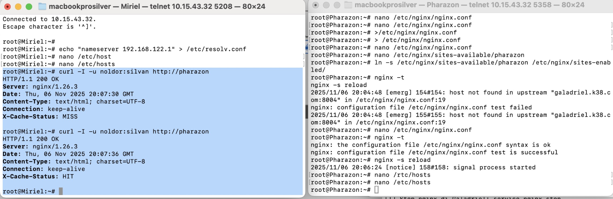

